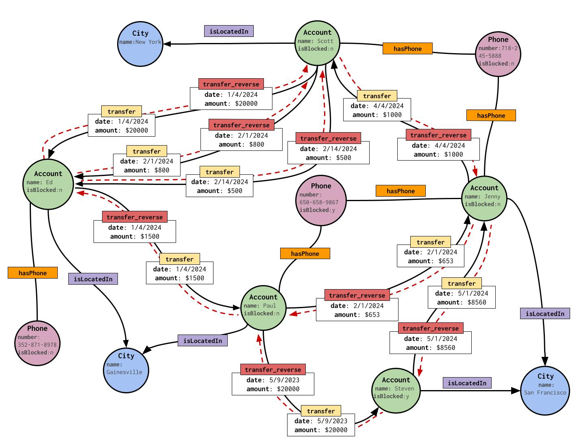

# Sample Graph To Start With 


# Content
This GSQL tutorial contains <a name="top"></a>
- [Setup enviroment](#setup-enviroment)
- [Setup schema (model)](#setup-schema)
- [Load data](#load-data)
- [Query Examples](#query-examples)

# Setup Enviroment 

Follow [Docker setup ](https://github.com/tigergraph/ecosys/blob/master/demos/guru_scripts/docker/README.md) to setup your docker enviroment.

[Go back to top](#top)

# Setup Schema 
Copy [ddl.gsql](./script/ddl.gsql) to your container. 
Next, run the following in your container's bash command line. 
```
gsql ddl.gsql
```

[Go back to top](#top)

# Load Data 
Copy [load.gsql](./script/load.gsql) to your container. 
Copy the following data files to your container.

- [account.csv](https://raw.githubusercontent.com/tigergraph/ecosys/master/demos/guru_scripts/docker/tutorial/4.x/data/account.csv)
- [city.csv](https://raw.githubusercontent.com/tigergraph/ecosys/master/demos/guru_scripts/docker/tutorial/4.x/data/city.csv)
- [phone.csv](https://raw.githubusercontent.com/tigergraph/ecosys/master/demos/guru_scripts/docker/tutorial/4.x/data/phone.csv)
- [hasPhone.csv](https://raw.githubusercontent.com/tigergraph/ecosys/master/demos/guru_scripts/docker/tutorial/4.x/data/hasPhone.csv)
- [locate.csv](https://raw.githubusercontent.com/tigergraph/ecosys/master/demos/guru_scripts/docker/tutorial/4.x/data/locate.csv)
- [transfer.csv](https://raw.githubusercontent.com/tigergraph/ecosys/master/demos/guru_scripts/docker/tutorial/4.x/data/transfer.csv)
  
Next, run the following in your container's bash command line. 
```
gsql load.gsql
```

[Go back to top](#top)

# Query Examples 

## Node Pattern
Copy [q1a.gsql](./script/q1a.gsql) to your container. 

```sql
#enter the graph
USE GRAPH financialGraph

# create a query
CREATE OR REPLACE QUERY q1a () SYNTAX v3 {

  # select from a node pattern-- symbolized by ()
  # v is a vertex set variable, holding the selected vertex set
  v = SELECT a
      FROM (a:Account);

  # output vertex set variable v in JSON format
  PRINT v;
}

#compile and install the query as a stored procedure
install query q1a

#run the query
run query q1a()
```

You can group by on the matched node table, just as you group by a table and aggregate in SQL. 

Copy [q1b.gsql](./script/q1b.gsql) to your container. 

```sql
#enter the graph
USE GRAPH financialGraph

CREATE OR REPLACE QUERY q1b () SYNTAX v3 {

  SELECT a.isBlocked, count(*) INTO T
  FROM (a:Account)
  GROUP BY a.isBlocked;

  PRINT T;
}

#compile and install the query as a stored procedure
install query q1b

#run the query
run query q1b()
```

[Go back to top](#top)

## Edge Pattern 
Copy [q2a.gsql](./script/q2a.gsql) to your container. 

```sql

USE GRAPH financialGraph

# create a query
CREATE OR REPLACE QUERY q2 (string accntName) SYNTAX v3 {

  // declare an local sum accumulator; you can keep adding values into it
  // "local accumulator" means each vertex will have an accumulator of
  // the declared type and can be accumulated into based on the 
  // FROM clause pattern.
  SumAccum<int> @totalTransfer = 0;

  // match an edge pattern-- symbolized by ()-[]->()
  // v is a vertex set variable holding the selected vertex set
  v = SELECT b
      FROM (a:Account {name: accntName})-[e:transfer]->(b:Account)
      //for each matched row, do the following accumulation
      ACCUM  b.@totalTransfer += e.amount;

  //output each v and their static attribute and runtime accumulators' state
  PRINT v;

}

#compile and install the query as a stored procedure
install query q2

#run the query
run query q2("Scott")
```

You can group by on the matched edge table, just as you group by a table and aggregate in SQL. 

Copy [q2b.gsql](./script/q2b.gsql) to your container. 

```sql
USE GRAPH financialGraph

CREATE OR REPLACE QUERY q2b () SYNTAX v3 {

  //think the FROM clause is a matched table with columns (a, e, b)
  //you can use SQL syntax to group by the source and target account, and sum the total transfer amount
  SELECT a, b, sum(e.amount)  INTO T
  FROM (a:Account)-[e:transfer]->(b:Account)
  GROUP BY a, b;

  //output the table in JSON format
  PRINT T;

}

#compile and install the query as a stored procedure
install query q2b

#run the query
run query q2b()
```

[Go back to top](#top)

## Path Pattern 
Copy [q3a.gsql](./script/q3a.gsql) to your container. 

```sql
USE GRAPH financialGraph

// create a query
CREATE OR REPLACE QUERY q3 (datetime low, datetime high, string accntName) SYNTAX v3 {

  // a path pattern in ascii art () -[]->()-[]->()
  R = SELECT b
      FROM (a:Account {name: accntName})-[e:transfer]->()-[e2:transfer]->(b:Account)
      WHERE e.date >= low AND e.date <= high and e.amount >500 and e2.amount>500;

      PRINT R;

  // below we use variable length path.
  // *1.. means 1 to more steps of the edge type "transfer"
  // select the reachable end point and bind it to vertex alias "b"
  R = SELECT b
      FROM (a:Account {name: accntName})-[:transfer*1..]->(b:Account);

      PRINT R;

}

install query q3

run query q3("2024-01-01", "2024-12-31", "Scott")
```
You can group by on the matched path table, just as you group by a table and aggregate in SQL. 

Copy [q3b.gsql](./script/q3b.gsql) to your container. 

```sql
USE GRAPH financialGraph

// create a query
CREATE OR REPLACE QUERY q3b (datetime low, datetime high, string accntName) SYNTAX v3 {

   // a path pattern in ascii art () -[]->()-[]->()
   // think the FROM clause is a matched table with columns (a, e, b, e2, c)
   // you can use SQL syntax to group by on the matched table
   // Below query find 2-hop reachable account c from a, and group by the path a, b, c
   // find out how much the mid account b transfer to c.
   SELECT a, b, c, sum(DISTINCT e.amount) AS hop_1_sum,  sum(DISTINCT e2.amount) AS hop_2_sum INTO T1
   FROM (a:Account)-[e:transfer]->(b)-[e2:transfer]->(c:Account)
   WHERE e.date >= low AND e.date <= high
   GROUP BY a, b, c;

   PRINT T1;

   // below we use variable length path.
   // *1.. means 1 to more steps of the edge type "transfer"
   // select the reachable end point and bind it to vertex alias "b"
   // note: 
   // 1. the path has "shortest path" semantics. If you have a path that is longer than the shortest,
   // we only count the shortest. E.g., scott to scott shortest path length is 4. Any path greater than 4 will
   // not be matched.
   // 2. we can not put an alias to bind the edge in the the variable length part -[:transfer*1..]->, but 
   // we can bind the end points (a) and (b) in the variable length path, and group by on them.
   SELECT a, b, count(*) AS path_cnt INTO T2
   FROM (a:Account {name: accntName})-[:transfer*1..]->(b:Account)
   GROUP BY a, b;

   PRINT T2;

}

install query q3b

run query q3b("2024-01-01", "2024-12-31", "Scott")
```

[Go back to top](#top)

# Support 
If you like the tutorial and want to explore more, join the GSQL developer community at 

https://community.tigergraph.com/

Or, study our product document at

https://docs.tigergraph.com/gsql-ref/current/intro/

[Go back to top](#top)


